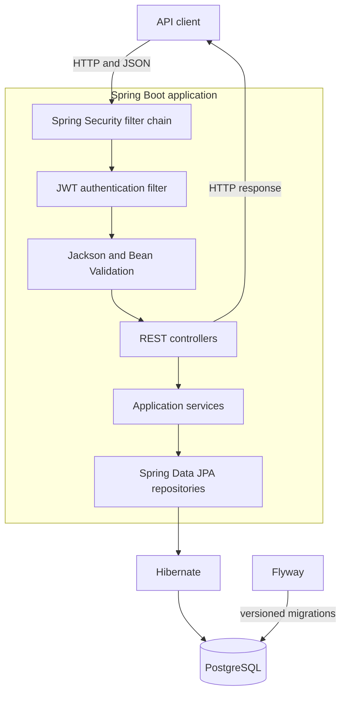
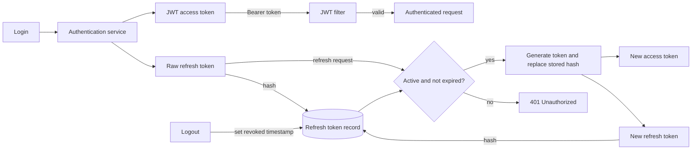

# Awake?

**Awake?** is a social availability app that helps friends understand whether it is a good time to call, send a message, or wait until later.

Online presence alone is ambiguous: a person may be awake but busy, available for messages but not calls, or asleep in another time zone. Awake? is intended to make that context explicit.

## Project status

The repository currently focuses on the Java backend. Authentication and session management are implemented; the product features and Android client are the next part of the project.

### Implemented

- User registration and authentication
- Short-lived JWT access tokens
- Opaque refresh tokens generated with `SecureRandom`
- Refresh tokens stored as hashes rather than raw values
- Refresh token rotation using one database record per session
- Logout through refresh token revocation
- Request validation and authentication error responses
- PostgreSQL persistence with Flyway migrations

### Product scope

| Feature                 | Purpose                                           |
| :---------------------- | :------------------------------------------------ |
| **Availability status** | Show whether calls or messages are welcome        |
| **Friends**             | Share availability with a defined circle of users |
| **Sleep schedule**      | Reflect expected sleeping hours automatically     |
| **Time-zone awareness** | Present availability in the correct local context |
| **Android client**      | Provide a native Kotlin interface for the service |

The planned availability states are **Available**, **Text only**, **Do not disturb**, and **Sleeping**.

## Backend architecture

The diagram shows how authentication, request processing, and persistence connect inside the backend.

## Authentication flow

Access and refresh tokens have separate responsibilities. Access tokens are short-lived JWTs used for API authorization. Refresh tokens are opaque values whose hashes are persisted, allowing sessions to be rotated and explicitly revoked.

After rotation, the previous refresh token no longer matches the stored hash and cannot be used again. Logout marks the session record as revoked.

## Tech stack

| Area                    | Technologies                                              |
| :---------------------- | :-------------------------------------------------------- |
| **Backend**             | Java, Spring Boot                                         |
| **Authentication**      | Spring Security, JWT access tokens, opaque refresh tokens |
| **Persistence**         | PostgreSQL, Spring Data JPA, Hibernate                    |
| **Database migrations** | Flyway                                                    |
| **API boundary**        | Jackson, Bean Validation                                  |
| **Mobile client**       | Kotlin, Android _(planned)_                               |

