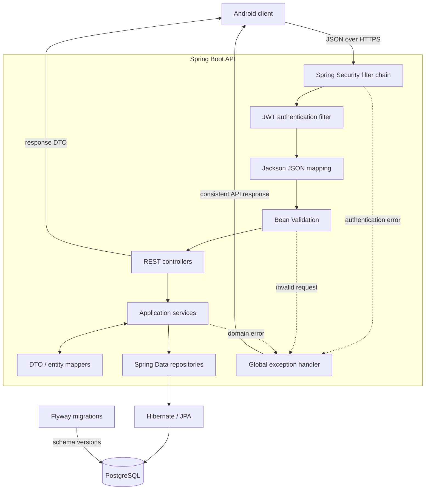
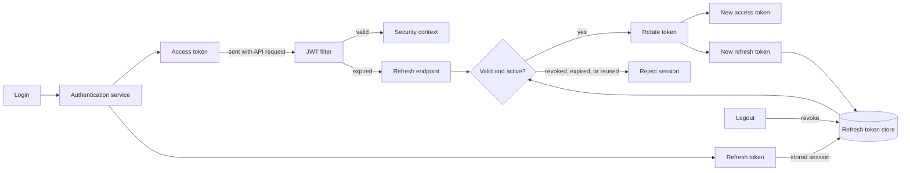

# Awake?

### The green dot doesn't tell the whole story.

Know whether it is a good time to call, better to text, or wiser to wait until morning.

---

Someone can be online and still be unavailable.

They may be working, sleeping in another time zone, open to messages but not calls, or simply taking a quiet evening. Most apps reduce all of that to a tiny green circle.

**Awake?** is a social availability app built around a more useful question:

> Not "Are they online?"  
> **"Is this a good moment?"**

## One glance, a clearer answer

| Status | What it means |
| :--- | :--- |
| **Available** | Calls and messages are welcome |
| **Text only** | Messages are welcome, calls are not |
| **Do not disturb** | Better check back later |
| **Sleeping** | Probably tomorrow’s conversation |

The long-term idea is simple: combine explicit status, sleep schedule, and time zone so availability can stay useful without demanding constant attention from the user.

## What is being built

Awake? is designed as a small, complete social product rather than a collection of isolated features.

| Part of the product | What it brings |
| :--- | :--- |
| **Identity** | Personal accounts and secure sessions across devices |
| **Availability** | A clear answer to whether someone is open to calls or messages |
| **Friends** | A private circle where availability is actually useful |
| **Smart schedule** | Status that understands sleep hours and local time |
| **Privacy** | Control over who can see each part of your availability |
| **Android app** | A native place to check in or update your status in seconds |

Behind that experience is a Java and Spring Boot API, PostgreSQL storage, secure token-based authentication, and a native Kotlin client. Each part has one job: keep the interaction quick for the user and the system predictable underneath.

## Inside the backend

The API follows a layered structure: transport details stay at the edge, business rules live in services, and persistence remains behind repositories.

Authentication uses short-lived access tokens for everyday requests and stateful refresh tokens for long-lived sessions.

This split keeps regular requests fast while refresh token rotation, revocation, and reuse checks protect the longer-lived session.

## Why this project

Awake? is deliberately more than a CRUD exercise. It is a compact product with the kinds of problems that make backend development interesting: authentication, mutable state, relationships between users, privacy, time-dependent behaviour, and a mobile client that needs a clean contract.

The aim is not to imitate a production system with unnecessary complexity. It is to build one thoughtfully, feature by feature, and let the architecture earn its shape.

---

**Built to make availability feel human.**  
Fewer guesses. Fewer badly timed calls.

